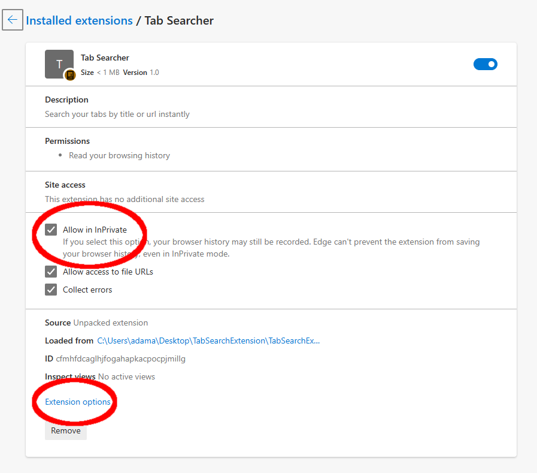

# Tab Searcher
A Basic Tab Searcher: Use Ctrl+Shift+F to search for and activate a tab.

## Usage
Press Ctrl+Shift+F to bring up Search Window.
As you type the search is converted to a case-insensitve Regex and matched against your tabs' Title and URL.
You can use the Up and Down Keyboard Arrows to navigate the list and press Enter to select a Tab. You can also use the mouse to click on the Tab you want.
Once selected the Tab's Window will be focused/brought to the fore and the Tab will be activated.

## Advanced Usage
* The special term "playing" will filter for Tabs that are currently audible.
* Incognito Windows/Tabs are automatically ignored. In order to include them follow the following steps:
  * Click "Allow in Incognito/InPrivate/etc." under the Extension's "details" page
  * Open the Extensions Option's page and select "Search Incognito Tabs"

    

## Installation
[See this guide](https://adamantlife.github.io/browserextension.html)